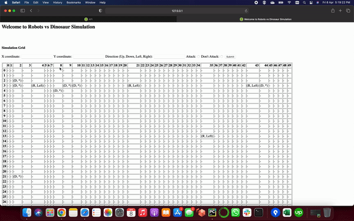

# robo-vs-dino-simulation
## Getting Started

#### Application Description

This application is assembling an army of remote-controlled robots to fight the dinosaurs and the first step towards that is to run simulations on how they will perform.
  
**Features Included:**  
- Simulation grid space of 50*50
- Create Robot (with attributes: axis info, direction, attack flag, id and optional description) anywhere within grid
- Create Dinosaur (with attributes: axis info, id and optional description)
- Robot can move anywhere in grid boundary
- Robot attack can destroy dinosaur around it
- Simulation grid (dataframe) as table view in UI side (/webapp route)
- Data saving is presistent/immutability (json file)
- Documentation of APIs with samples 

#### Run Application

2 ways of running this project:

**Run using Dockers:**  
-  Make sure docker is installed on your machine.  
-  Run following command to create project image:  
`docker build -t robo-vs-dino-img .`

- Check/confirm docker image is create with provided name (robo-vs-dino-img) by command:  
`docker images`

- Create docker container using image name by:  
`docker run --name robo-vs-dino-container -p 5000:5000 -d robo-vs-dino-img`

-  Check/confirm container is available and 'Up' by using command:  
`docker ps -a`

-  After that:  
Open http://0.0.0.0:5000 on browser to see project app.

 

**Run using Terminal/Python:**  
-  Make Sure python 3 and pip (python package installer) installed on your system to run this project.
-  On root directory of project run:   
`pip install -r requirements.txt` or `pip3 install -r requirements.txt`   
to install required packages.  
- If face any issues while meeting packages and python versions conflicts on your environment, try install 4 packages (pandas, flask-restplus, Werkzeug, Flask) manually using command:
`pip install <package_name>`
-  (Optional) Before run application run a unit in root directory by using command:  
 `python -m tests.grid_test`   and  `python -m tests.unit_test`
-  After that:  
`python run.py` or `python3 run.py`  
Open http://127.0.0.1:5000 on browser to see project app. 

**Note:**  
A small limitation due to time constraint: Before running unit test (`python -m tests.unit_test`) of flask API (/create_entity) second time, 
please update existing coordinates. As application won't
allow to create another entity with same coordinate which ultimately fails 
the unit test.
 

**Project Important Instructions:**  

- By opening http://127.0.0.1:5000 or http://0.0.0.0:5000 on your browser the first thing you will
see is APIs dashboard. Simulation grid and robot instruction page should available at route 
http://127.0.0.1:5000/webapp (or http://0.0.0.0:5000/webapp).

- Due to time constraint all project functionality e.g. create robot, create dinosaur, delete robot/dinosaur
etc. not available on /webapp route. However, these functionalities included in app and can be achieved using
APIs swagger dashboard at http://127.0.0.1:5000.

- Dashboard at http://127.0.0.1:5000 provides APIs documentation, APIs listing, api model/design patterns,
APIs request sample payload, error code details etc. Please follow instructions on dashboard to execute APIs.

### Application Structure

─ app 
&nbsp;&nbsp;&nbsp;&nbsp;&nbsp;&nbsp;─ simulation.py  
&nbsp;&nbsp;&nbsp;&nbsp;&nbsp;&nbsp;─ storage_util.py  
&nbsp;&nbsp;&nbsp;&nbsp;&nbsp;&nbsp;─ simulation_data  
&nbsp;&nbsp;&nbsp;&nbsp;&nbsp;&nbsp;&nbsp;&nbsp;&nbsp;&nbsp;&nbsp;&nbsp;&nbsp;&nbsp;─ robo_vs_dino.json  
─ templates 
&nbsp;&nbsp;&nbsp;&nbsp;&nbsp;&nbsp;─ result.html  
─ tests 
&nbsp;&nbsp;&nbsp;&nbsp;&nbsp;&nbsp;─ __init__.py  
&nbsp;&nbsp;&nbsp;&nbsp;&nbsp;&nbsp;─ unit_test.py  
&nbsp;&nbsp;&nbsp;&nbsp;&nbsp;&nbsp;─ grid_test.py  
─ app.py 
─ config.py 
─ Dockerfile 
─ README.md 
─ requirements.txt 

This is my application structure based on requirements and scope. 

#### Application Approach:

I have picked this approach regarding application design, libraries and structure based on limited time and scope. 
It can be improved with increased scope.

#### Security Policy and conventions compromised due to time limitations:

- Storage should be database management system that provides special interface to make changes in application data. Using
single json file has many issue in term of privacy, roles, tranparency b/w different feature and increased scope etc.

### More things can be doable if spend more time

- Use of DB for storing entities as single json file has many limitations.
- More tests can be added in tests directory.
- More error handling by using try catch and if else statements can be add in code.
- More UI control can be added on webpage i.e. create robot, create dinosaur, delete robot/dinosaur etc.
- Currently same API developed for entity (robot/dinosaur) creation. So, API is taking direction from dinosaur as required argument
  (but in the backend direction for dinosaur is mean nothing and json also not storing direction for dinosaur). This feature issue
  need to be fixed.
 - If wants to go with json file so use of 'IDs' (in etity object) to perform read/write in file.
- As I'm using logging library so log file need to have somewhere in project directory for better app maintenance and debugging. 

### Demo

